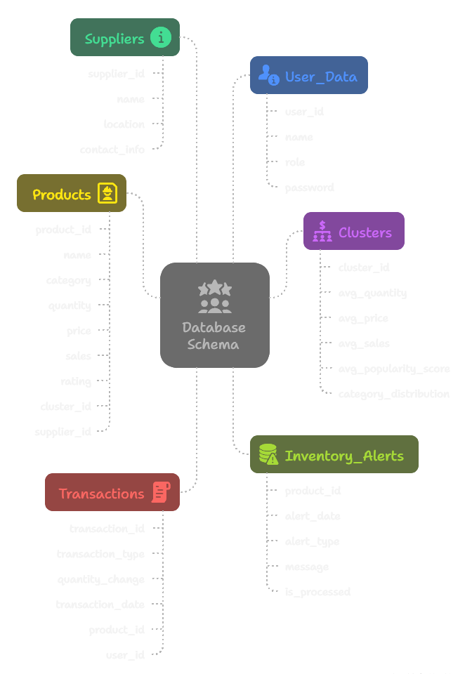

# Smart Inventory Management System

The **Smart Inventory Management System** is a web-based application designed to streamline inventory management for businesses. It provides features for administrators and users to manage products, suppliers, clusters, and transactions efficiently. The system also includes advanced functionalities like product recommendations, alerts, and user management.

---

## Features

### Admin Features
- **Supplier Management**:
  - Add, update, delete, and view supplier details.
  - Group suppliers by location and filter by city or country.

- **Product Management**:
  - Add, update, delete, and view product details.
  - Conduct stock-in and stock-out transactions.

- **Cluster Management**:
  - Filter clusters based on metrics like average quantity, price, sales, and popularity.
  - View detailed cluster data, including category distribution.
  - Reassign products to different clusters.

- **User Management**:
  - View and delete non-admin users.

- **Alerts**:
  - View inventory alerts for products.
  - Mark alerts as processed.

### User Features
- **Product Recommendations**:
  - Get product recommendations based on category or product name.

- **Buy Products**:
  - Purchase products by specifying the quantity.

- **View Transactions**:
  - View transaction history.

- **Change Password**:
  - Update account password securely.

### Machine Learning Features

- **Product Clustering**:
  - Automatic product grouping using HDBSCAN clustering algorithm.
  - Groups products based on price, sales, popularity, and category.

- **Intelligent Recommendations**:
  - Cluster-based product suggestions for enhanced user experience.
  - Category-based recommendations using ML insights.

---

## Database Schema and ER Diagram



## Technologies Used

- **Frontend**: Streamlit
- **Backend**: Python
- **Database**: Oracle Database
- **Machine Learning**: Scikit-learn, HDBSCAN and UMAP
---

## Project Demo 

[](https://www.youtube.com/watch?v=xMyKkujmtHs)


## Installation 

### Steps
1. Clone the repository:
   ```bash
   git clone https://github.com/Armaan457/Smart-Inventory-Management-System.git
   ```

2. Create and activate a virtual environment:
   ```bash
   python -m venv env
   \env\Scripts\activate
   ```

3. Install dependencies:
   ```bash
   pip install -r requirements.txt
   ```

4. Run the application:
   ```bash
   streamlit run app.py
   ```

## Developers
- Armaan Jagirdar
- Vansh Garg
- Yatharth Sharma
- Arnav Aggarwal